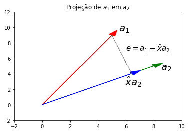

Há um famoso algoritmo em Álgebra Linear para ortogonalizar um conjunto
de vetores (isto é, torná-los perpendiculares entre si) com etapas bem
simples, que então imaginei valer a pena tentar escrever o código para
ele, pelo aprendizado.

Se você nunca ouviu falar nisso, pode estar se perguntando por que isso
seria útil. A resposta curta é que torna tudo mais fácil numericamente,
já que o produto interno de dois vetores ortogonais é igual a zero.
Intuitivamente, se você interpretar o produto interno como uma
"projeção" de um vetor sobre o outro, isso quer dizer que os dois
vetores não tem uma "correlação" em termos de direção. Geometricamente,
também quer dizer que eles estão separados por um ângulo de 90º.

Por exemplo, os três vetores abaixo são vetores ortogonais:

``` python
%matplotlib inline
import matplotlib.pyplot as plt

fig = plt.figure()
ax = fig.add_subplot(projection='3d')

ax.quiver(0, 0, 0, 1, 0, 0, color="red")
ax.quiver(0, 0, 0, 0, 1, 0, color="blue")
ax.quiver(0, 0, 0, 0, 0, 1, color="green")

ax.set_xlim(-1, 1, 1)
ax.set_ylim(-1, 1, 1)
ax.set_zlim(-1, 1, 1)
```


Para ver como um conjunto ortogonal de vetores é mais conveniente que um
outro conjunto qualquer, vamos supor uma matriz \\( Q \\) cujas colunas são
vetores ortonormais, nova palavra que indica que, além de serem
perpendiculares entre si, o comprimento deles é igual a 1 (sua norma é
unitária).

Se isso é verdade, então podemos dizer que \\( Q^{T}Q = I \\). E, se \\( Q \\) for
quadrada, então \\( Q^T \\) é então a inversa de \\( Q \\)\!\!

Isso porque

\\(  q^{T}_{i}q_j = \begin{cases} 0, & \text{se } i \neq j
\cr 1, & \text{se } i = j \end{cases}  \\)

Para entender o que está havendo, temos que notar que \\( Q^{T}Q \\)
simplesmente pede por todos os produtos internos dos vetores dessa
matriz. Quando um vetor é multiplicado por um que não ele (\\(  i \neq
j \\)), então o resultado é 0. Se não, o resultado é 1 (sua norma ao
quadrado, já que eles são vetores unitários).

É dessa forma que uma operação complexa como inverter uma matriz
torna-se trivial no caso de uma matriz ortogonal (quadrada e com vetores
ortonormais). Assim fica evidente quais são os seus benefícios.

Por isso é útil usar a ideia de Gram-Schmidt, que procura decompor uma
matriz \\( A \\) qualquer em uma matriz com vetores ortonormais \\( Q \\) e uma
matriz \\( R \\) que conecta as duas:

$$
A = QR
$$

Como eles fazem isso? A ideia básica é a seguinte e está intimamente
ligada ao conceito de projeção. Por isso, vamos entender o que é isso
antes. Esta ideia é melhor ilustrada em duas dimensões, então vamos
supor uma matriz 2x2:

``` python
# não se importe com o código, tá bem messy (eu sou péssimo com matplotlib)
import numpy as np

np.random.seed(1)
A = np.random.randint(0, 10, 4).reshape((2, 2))

fig, ax = plt.subplots()

a1 = A[:, 0]
a2 = A[:, 1]
projection = (a1.dot(a2) / a1.dot(a1)) * a2
e = a1 - projection

ax.arrow(0, 0, *a1, color="red", head_width=0.5)
ax.arrow(0, 0, *a2, color="green", head_width=0.5)
ax.arrow(0, 0, *projection, color="blue", head_width=0.5)
ax.arrow(*projection, *e, color="grey", linestyle="--")

ax.set_xlim(-2, 10)
ax.set_ylim(-2, 12)

ax.annotate("$a_1$", a1 + 0.5, fontsize=20)
ax.annotate("$a_2$", a2 + [0.5, -0.5], fontsize=20)
ax.annotate("$\hat{x}a_2$", projection - [0.5, 1.5], fontsize=20)
ax.annotate("$e = a_1 - \hat{x}a_2$", e + projection + [1, -2], fontsize=15)
ax.set_title(r"Projeção de \\( a_1 \\) em \\( a_2 \\)")
```

<!-- -->

Essa figura serve para ilustrar o que queremos fazer: dado dois vetores,
podemos ortogonalizar um em relação ao outro ao subtrair do vetor \\( a_1 \\)
o que ele tem de comum com o vetor \\( a_2 \\), isto é, sua projeção no vetor
\\( a_2 \\). Essa diferença é o "erro" da projeção, o \\( e \\).

A projeção de \\( a_1 \\) em \\( a_2 \\) é um múltiplo de \\( a_2 \\), \\( \hat{x}a_2 \\).
A diferença entre \\( a_1 \\) e \\( \hat{x}a_2 \\), \\( e \\), é perpendicular a todo o
espaço vetorial preenchido por \\( a_2 \\). Logo, basta descobrir qual é este
múltiplo \\( \hat{x} \\):

$$
a^{T}_2(a_1 - \hat{x}a_2) = 0 \\ a^{T}_2a_1 =
\hat{x}a^{T}_2a_2 \\ \hat{x} = \frac{a^{T}_2a_1}{a^{T}_2a_2}
$$

Se você reparar bem, essa foi exatamente a conta que eu fiz para obter a
variável de nome `projection` no código acima.

Isso é facilmente generalizado para n-dimensões, um sistema de equações
conhecido como equações normais, uma das fórmulas mais importantes para
a Estatística por ser a que fundamenta o modelo clássico de regressão
linear. A fórmula em si é muito parecida com a de cima, e a
interpretação é a mesma, ela projeta o vetor \\( b \\) no espaço vetorial
expandido pelas colunas de \\( A \\). Isso se faz porque não há uma solução
para \\( Ax = b \\), então se pretende chegar à melhor solução possível, a
solução que minimiza a soma do quadrado dos resíduos.

$$
\hat{x} = (A^TA)^{-1}A^Tb
$$

E o vetor em si, o vetor projetado em \\( A \\), é simplesmente \\( A\hat{x} \\),
obtido pelo produto do que agora chamaremos matriz de projeção,
\\( A(A^TA)^{-1}A^T \\), com o vetor \\( b \\):

$$
\hat{b} = A\hat{x} = A(A^TA)^{-1}A^Tb 
$$

Mas o nosso objetivo é, na verdade, obter o vetor ortogonal \\( e \\), o erro
da projeção, que é sempre ortogonal ao sub-espaço sobre o qual estamos
projetando o nosso vetor:

$$
e = b - A\hat{x} = b - A(A^TA)^{-1}A^Tb = (I - A(A^TA)^{-1}A^T)b 
$$

E assim vemos que, como há a matriz de projeção de \\( b \\) sobre o
sub-espaço expandido pelas colunas de \\( A \\), há também a projeção de \\( b \\)
sobre o sub-espaço ortogonal em \\( R^n \\), que é obtido ao multiplicar \\( b \\)
com a matriz conhecida como *annihilator matrix*, \\( (I -
A(A^TA)^{-1}A^T) \\). Essa matriz é a *residual maker* na regressão linear.
E é justamente o que precisamos aqui também\!

Ok, enough theory. Agora eu espero ter deixado claro qual o nosso
objetivo: ortogonalizar os vetores ao projetá-los em um sub-espaço
ortogonal.

Vamos pegar uma matriz 3x3 qualquer:

``` python
np.random.seed(1)
A = np.random.randint(0, 10, 9).reshape((3, 3))

A
```

    array([[5, 8, 9],
           [5, 0, 0],
           [1, 7, 6]])

O primeiro vetor não precisa ser ortogonalizado, vamos só normalizá-lo
dividindo-o por seu comprimento.

Já o segundo, queremos projetar no sub-espaço ortogonal ao sub-espaço
expandido pelo primeiro vetor.

E o terceito vetor sofrerá o mesmo processo: projeção no sub-espaço
ortogonal expandido pelos dois primeiros vetores. E assim vai.

Vamos ver se isso funciona. O código abaixo replica esse processo.

``` python
def orthogonalize(A, n):
    # vetor a ser ortogonalizado
    b = A[:, n][:, np.newaxis]
    # se for o primeiro vetor, somente normalize (norma igual a um)
    if n == 0:
        return b / np.linalg.norm(b)
    # se não, vamos ortogonalizar
    else:
        # espaço vetorial preenchido pelos vetores antecessores
        # sobre o qual precisamos projetar o vetor b
        X = A[:, range(0, n)]
        # matriz identidade nxn (n = número de linhas)
        I = np.eye(X.shape[0])
        # construir a annihilator matrix, para projetar o vetor b no sub-espaço
        # ortogonal ao espaço coluna de X, em R^n
        M = I - X @ np.linalg.inv(X.T @ X) @ X.T
        # fazer a projeção e retornar normalizado
        e = M.dot(b)
    return e / np.linalg.norm(e)


def q(A):
    return np.concatenate([orthogonalize(A, i) for i in range(3)], axis=1)


Q = q(A)
Q
```

    array([[ 0.70014004,  0.40635191,  0.58709629],
           [ 0.70014004, -0.55198092, -0.45290285],
           [ 0.14002801,  0.72814504, -0.67096718]])

Se tudo está correto, a multiplicação \\( Q^{T}Q \\) deve retornar a
identidade:

``` python
Q.T.dot(Q)
```

    array([[ 1.00000000e+00, -1.38777878e-17, -8.04911693e-16],
           [-1.38777878e-17,  1.00000000e+00,  6.66133815e-16],
           [-8.04911693e-16,  6.66133815e-16,  1.00000000e+00]])

E, vemos que, sim, está correto\! O que fizemos foi mudar a base desse
espaço vetorial para uma base muito melhor de se lidar, já que sua
inversa é simplesmente a transposta.

``` python
(np.linalg.inv(Q).round(2) == Q.T.round(2)).all()
```

    True

Para obter a mesma matriz Q de forma mais confiável, você pode usar a
função `np.linalg.qr()`, que vai te retornar a matriz \\( Q \\) que obtemos e
a matriz \\( R \\) que conecta \\( Q \\) a \\( A \\). O ideal seria um algoritmo que
retornasse os dois, como este do NumPy, mas a verdade é que não achei um
jeito simples para isso.

Esse também, é claro, não é o algoritmo mais eficiente, mas funciona, e
acho que em termos de insight sobre como funcionam os sub-espaços
vetoriais, tem bastante a oferecer.

Matrizes ortogonais são muito importantes para a Álgebra Linear,
especialmente em termos numéricos. Gram-Schmidt é interessante porque
tem uma implementação simples e sua ideia agrega muitos conceitos
importantes da área. Ele, naturalmente, pode ser muito melhorado e aqui
só quis passar a ideia básica por trás. Se quiser saber mais sobre o
assunto, recomendo esta aula do curso clássico de Gilbert Strang:



Como um bônus, aqui vai mais uma breve razão que faz as matrizes
ortonormais serem tão desejáveis na computação:

$$
| Qv |^{2} = (Qv)^{T}(Qv) = v^TQ^TQv = v^Tv = | v |^{2}
$$

Isto quer dizer que a norma de um vetor \\( v \\), quando multiplicado por uma
matriz com vetores ortonormais \\( Q \\), não muda. Logo, a multiplicação é
numericamente estável porque não há risco de *overflow*\!\! Pretty neat.
:smiley:
