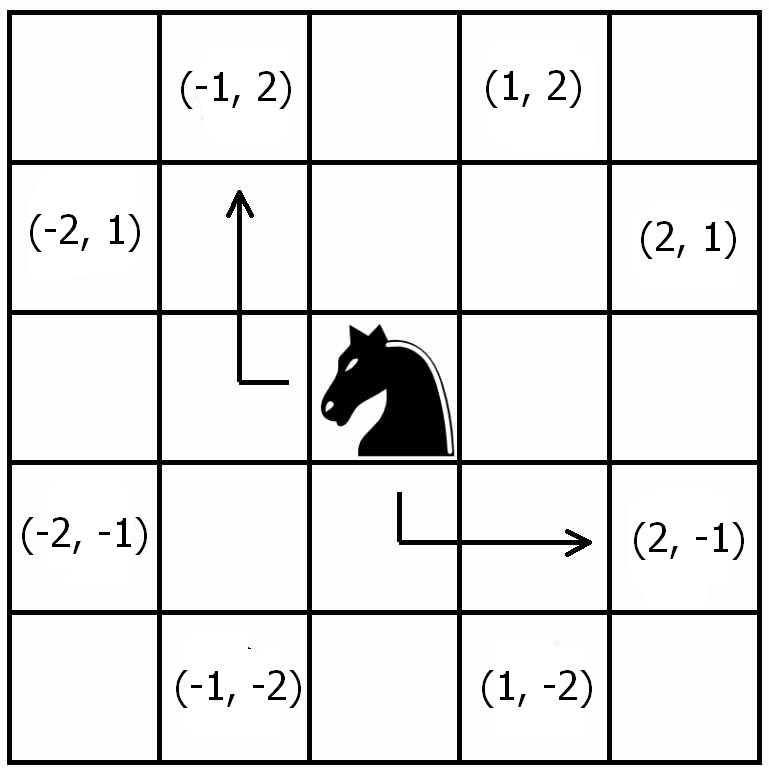

Para estrear o blog, escolhi explorar um puzzle probabilístico, que vi no
[blog do David Robinson](http://varianceexplained.org/r/knight-chess/), que
consiste em estimar a probabilidade de um cavalo voltar à sua posição inicial
após ter saltado aleatoriamente 20 vezes num tabuleiro de xadrez infinito (sendo
os 8 possíveis saltos igualmente prováveis).

Em seu post, David inteligemente escolhe abordar o problema pelo tidyverse, o
que o permite simular o experimento de maneira eficiente e numa estrutura que
facilita a criação de visualizações do problema com o ggplot2.

Porém esse aqui não é um post sobre R. Como estou aprendendo Python, achei que
seria interessante tentar fazer a mesma simulação com uma de suas bibliotecas
mais famosas, o Numpy, para praticar e ver se ele cumpre o que promete:
operações vetorizadas e eficientes.

# O que está por trás da eficiência do Numpy

O Numpy chega para suprir uma desvantagem que o Python tem por ser uma linguagem
de tipagem dinâmica e de script (não-compilada): ele não é tão bom em fazer
repetidas operações múltiplas vezes. Precisamente o que garante a ele uma
vantagem pelo lado do desenvolvimento de código (uma linguagem solta, fácil de
aprender) é o que compromete sua performance.

Para ilustrar essa dificuldade, vamos imaginar que queremos somar duas listas de
números elemento por elemento. Uma lista em Python comporta qualquer tipo de
dado (integer, float, string, ou até outras listas), e ele não tem como saber de
antemão que a lista é composta somente de integers, por exemplo. Então, o que
ele fará a cada operação é primeiro verificar o tipo de cada elemento para
depois descobrir que "soma" ele deve fazer. Porque, por exemplo, somar dois
integers é diferente de somar dois strings:

```python
1 + 2
```

```
3
```

```python
"1" + "2"
```

    '12'

E é esse type-checking uma das razões que acabam retardando muito a operação
como um todo, principalmente quando isso vai se acumulando na casa dos milhões.
Numa linguagem compilada e em que você precisa declarar o tipo de suas
variáveis, isso não seria um problema.

O que o Numpy faz é, ao invés de verificar o tipo dos elementos cada vez que a
operação for chamada, ele o faz uma vez somente para depois executar a operação
a partir dessa informação (para isso serve o atributo 'dtype' do ndarray - de
n-dimensional array -, a estrutura de dados básica do Numpy). Além disso, as
operações rodam no background em código C.

O custo disso é que a estrutura básica do Numpy perde a flexibilidade da lista,
já que ele comportará um tipo de dado somente. Mas é um custo que estamos
dispostos a pagar. Por exemplo:

```python
import numpy as np

a = np.array([1, 2, 3, 4])

a.dtype
```

    dtype('int32')

Se tentarmos incluir um string nesse ndarray, ele será convertido para um
integer:

```python
a[0] = "12"
a
```

    array([12,  2,  3,  4])

Mas se tentarmos incluir um número complexo, obtemos um erro:

```python
a[0] = 2 + 1j
```

    ---------------------------------------------------------------------------

    TypeError                                 Traceback (most recent call last)

    <ipython-input-6-65561a8fbe75> in <module>
    ----> 1 a[0] = 2+1j


    TypeError: can't convert complex to int

Esse comportamento é muito similar ao vetor do R.

# Simulando os movimentos do cavalo

Dito isto, vejamos o que o Numpy pode fazer. Mas antes um esclarecimento

- devo todo o thought process no que diz respeito à modelagem ao Robinson, e
  encorajo a todos lendo que confiram o post dele, se não antes, depois de ler
  aqui. O único trabalho que tive foi o de escrever o código em Python.

A ideia de Robinson para a simulação foi imaginar o tabuleiro como um plano
cartesiano, em que o cavalo está no ponto de origem, (0, 0), podendo saltar dali
para oito casas possíveis, com igual probabilidade, respeitando sempre as regras
do xadrez, como na imagem:



Daí podemos notar que, se o cavalo pular para uma casa de coordenada x, a
coordenada y terá que ser igual a 3 - abs(x). Mas devemos tomar o cuidado para
assegurar que a coordenada y também possa ser negativa.

Com isso em mente, podemos simular um único salto.

```python
# sorteamos um dos números em parênteses para obter o x
x = np.random.choice((1, 2, -1, -2))

# e calculamos o y pela relação já descrita
y = (3 - abs(x)) * np.random.choice((1, -1))

print(x, y)
```

    2 1

Mas, é claro, não é interessante simular somente um salto. Queremos, na verdade,
20 deles, precisamos de um vetor.

```python
move_x = np.random.choice((1, 2, -1, -2), size=20)
move_y = (3 - abs(move_x)) * np.random.choice((1, -1), size=20)

print(move_x, move_y, sep="\n")
```

    [-2  1 -1  2  1  1  2  2 -1 -2 -2  2 -1  2 -2  2 -1  1  2  1]
    [-1  2  2 -1 -2 -2  1 -1  2  1 -1  1  2 -1 -1  1 -2 -2  1  2]

Ótimo\! Foi bastante simples. É legal observar como funciona a sintaxe do Numpy.
Por ele ser totalmente voltado para operações vetoriais, podemos fazer operações
aritméticas em vetores elemento por elemento sem qualquer for loop, bata
subtrair de 3 o valor absoluto do vetor move_x, como se ele fosse um escalar, e
está feito\!

Agora, sabendo disso, se realmente quisermos computar uma probabilidade, de nada
adianta termos somente uma amostra com vinte saltos aleatórios do cavalo,
precisamos de muitas mais. Vejamos com cem mil vezes mais. Com o Numpy, isso é
bem fácil de ser feito.

```python
move_x = np.random.choice((1, 2, -1, -2), size=20 * 100000).reshape((20, 100000))
move_y = (3 - abs(move_x)) * np.random.choice((1, -1), size=20 * 100000).reshape(
    (20, 100000)
)

print(move_x, move_y, sep="\n\n")  # sep = '\n\n' serve para espaçar o output do print
```

    [[ 1 -2  1 ... -1  2  2]
     [ 1  1 -2 ...  2  2 -2]
     [ 1  2 -1 ... -1  1  1]
     ...
     [-1  1  1 ...  2  2 -2]
     [-1  1  2 ...  1 -1  2]
     [-1 -2  1 ...  2 -2  2]]

    [[-2  1 -2 ...  2  1  1]
     [ 2 -2 -1 ...  1 -1 -1]
     [ 2 -1 -2 ...  2  2  2]
     ...
     [-2 -2  2 ...  1  1  1]
     [-2  2 -1 ...  2 -2 -1]
     [-2 -1 -2 ...  1 -1 -1]]

No código acima eu primeiro gerei 2 milhões de saltos em um vetor, e depois o
reorganizei como uma matriz 20 x 100.000. Me acostumei a enxergar matrizes como
vários vetores-coluna agrupados, então foi assim que fiz, questão de
preferência. Dessa forma, cada coluna representa uma tentativa e cada linha um
salto.

Para o próximo passo, queremos descobrir em que posição o cavalo está na medida
em que se move pelo tabuleiro. Podemos fazer isso ao calcular a soma cumulativa
das colunas.

Para isso, basta utilizarmos o método 'cumsum' do ndarray, com o argumento de
axis igualado a 0, o que quer dizer que ele vai fazer a soma cumulativa "down
the rows", linhas abaixo (o 0 é porque a linha é o "primeiro" elemento do
"shape" de uma matriz bidimensional, (20, 100000)), o que é justamente o que
queremos, já que interpretamos cada linha como um salto:

```python
position_x = move_x.cumsum(axis=0)
position_y = move_y.cumsum(axis=0)

print(position_x, position_y, sep="\n\n")
```

    [[ 1 -2  1 ... -1  2  2]
     [ 2 -1 -1 ...  1  4  0]
     [ 3  1 -2 ...  0  5  1]
     ...
     [ 4 -5 -8 ...  4 17  3]
     [ 3 -4 -6 ...  5 16  5]
     [ 2 -6 -5 ...  7 14  7]]

    [[ -2   1  -2 ...   2   1   1]
     [  0  -1  -3 ...   3   0   0]
     [  2  -2  -5 ...   5   2   2]
     ...
     [ 12  -7 -12 ...   0   9   1]
     [ 10  -5 -13 ...   2   7   0]
     [  8  -6 -15 ...   3   6  -1]]

Mas, como o que nos interessa para responder ao problema é somente a última
linha (onde ele parou no plano quando deu o último salto), podemos extrair
somente ela pedindo a linha de indíce -1 de nossa matriz (no Python, -1 equivale
ao último elemento, -2 ao penúltimo etc.).

```python
print(position_x[-1], position_y[-1], sep="\n\n")
```

    [ 2 -6 -5 ...  7 14  7]

    [  8  -6 -15 ...   3   6  -1]

Agora, para de fato termos uma estimativa da probabilidade do cavalo voltar à
origem após 20 saltos aleatórios, vamos calcular a frequência relativa desse
evento em cem mil tentativas. Podemos fazer isso da seguinte maneira:

```python
((position_x[-1] == 0) & (position_y[-1] == 0)).mean()
```

    0.00648

Aqui, o que o Numpy fez primeiro foi criar um vetor de booleans, ao comparar os
dois vetores elemento por elemento, retornando Verdadeiro somente quando ambos
foram iguais a zero, caso em que ele retornou para a origem concluído seu random
walk.

Calculado esse vetor, o que fiz foi pedir sua média, e isso me dá justamente a
frequência relativa do evento de interesse: é a contagem das vezes que o evento
aconteceu (a soma dos verdadeiros, lidos como 1 pelo método 'mean') sobre o
comprimento do vetor.

E assim está pronto. Este é um resultado coerente com o obtido por Robinson, o
que é confortante. A probabilidade em questão é de aproximadamente 0.6%; ou
seja, a cada 1000 tentativas, podemos esperar que, em média, em 6 delas o cavalo
voltará à origem após dar 20 saltos aleatórios.

Podemos ter um relance da distribuição de probabilidades do problema com um
simples histograma, feito com 100 repetições do experimento.

```python
import matplotlib.pyplot as plt
%matplotlib inline

# isso é uma list comprehension
knight_probs = [knight_infinite_board(100000) for _ in range(100)]

plt.hist(knight_probs, bins = 20)
```


# A eficiência em números

E, só para coisa não ficar vaga, quão eficiente é o Numpy afinal? Podemos
verificar isso facilmente com o magic command do IPython, o %%timeit. Criei uma
função que toma como argumento qualquer número de tentativas para testarmos o
algoritmo.

```python
def knight_infinite_board(trials):
    move_x = np.random.choice((1, 2, -1, -2), size=20 * trials)
    move_y = (3 - abs(move_x)) * np.random.choice((1, -1), size=20 * trials)

    position_x = move_x.reshape((20, trials)).cumsum(axis=0)[-1]
    position_y = move_y.reshape((20, trials)).cumsum(axis=0)[-1]

    return ((position_x == 0) & (position_y == 0)).mean()
```

```python
%%timeit
knight_infinite_board(100000) # cem mil tentativas
```

    130 ms ± 4.16 ms per loop (mean ± std. dev. of 7 runs, 10 loops each)

```python
%%timeit
knight_infinite_board(1000000) # 1 milhão!
```

    1.15 s ± 97.2 ms per loop (mean ± std. dev. of 7 runs, 1 loop each)

É extraordinariamente rápido. Mesmo quando se trata de cálculos com uma matriz
de 20 x 1 milhão\! E meu computador certamente não ajuda. O mesmo feito no base
Python seria absurdamente mais lento.

# Conclusões

Acho que com esse simples exercício, pudemos mesmo atestar que o Numpy é uma
ferramenta muito útil, garantindo eficiência com uma sintaxe simples e limpa. Há
dentro dele ainda muito mais a ser explorado do que o exposto aqui, incluindo as
mais diversas distribuições probabílistas com np.random, manipulação de matrizes
com np.linalg etc. O numpy é muito usado pelas mais importantes bibliotecas
relacionadas a Data Science e Machine Learning, como pandas e scikit-learn, por
isso um conhecimento apropriado de suas funcionalidades pode ajudar muito se o
objetivo é crescer na área de data science.

Pretendo trazer outros posts em que o usarei, mas por ora ficarei por aqui.
Espero que tenha sido proveitoso. Toda crítica/sugestão será muito bem-vinda.
